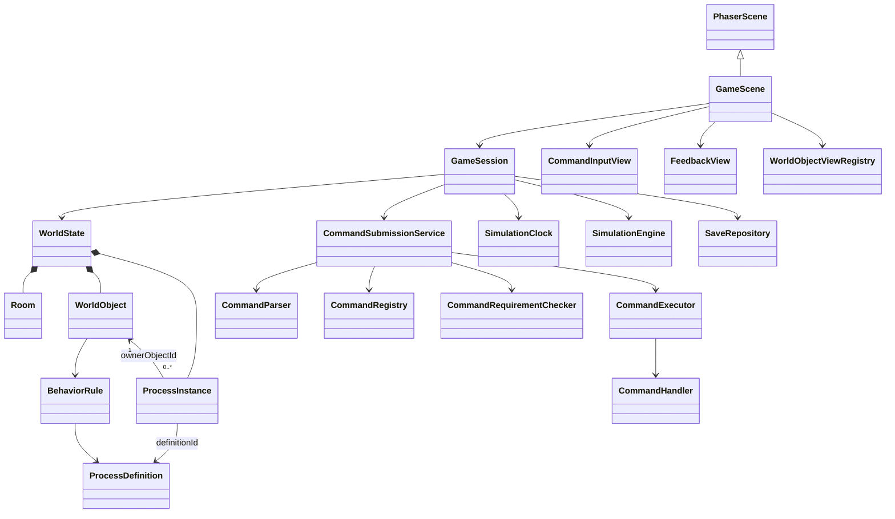

# Game Architecture

## Scope

This document describes the initial structure for the command-driven RTS game. The repository starts with Vite, TypeScript, and Phaser 4.2.1. The architecture below establishes module boundaries and class relationships without defining level content, command behavior, object attributes, or process logic.

## Architectural decisions

- One `GameScene` owns the Phaser runtime scene. The bottom command input and all game feedback are presented inside the game view.
- The game uses a 1920×1080 scene size and Phaser `FIT` scaling, centered in the browser viewport. It preserves the full scene at every viewport ratio and fills any unused area with a dark background; it does not enter browser fullscreen mode.
- The game world is a TypeScript domain model. Phaser objects render that model but are not the authoritative world state.
- Directory and file terminology is a command-facing metaphor. A virtual path resolves to a `Room` or `WorldObject`; the game does not model entities as operating-system files and never invokes the host shell.
- Only registered command handlers are executable. The initial grammar accepts one command per submitted line; pipes, chained commands, and player-written scripts are outside this foundation.
- Submitting a command from the input's send-key event runs the command pipeline synchronously. There is no command queue in the initial architecture.
- `ProcessDefinition` and `ProcessInstance` are separate concepts. A world object can have zero or more running instances, and behavior rules can select a definition based on conditions.
- Persistence is behind a repository interface and targets browser-local storage. A save snapshot includes world state and raw command history. The trigger and cadence for saving are outside this architecture decision.

## Runtime responsibilities

### Phaser scene

`GameScene` extends `Phaser.Scene` and uses a 1920×1080 reference coordinate space. Phaser scales that complete scene proportionally to fit the browser viewport and centers it over a dark background when the viewport has a different aspect ratio. Its runtime responsibilities are to create the in-canvas input and feedback views, wire them to a `GameSession`, and forward Phaser's frame delta to the session. It does not contain command rules, process behavior, or world-state rules.

The current scaffold mounts `PhaserCommandInputView` at the bottom center of `GameScene`. It accepts printable English ASCII, edits with the supported cursor keys, wraps at a fixed character count, and scrolls to keep the cursor visible. Enter submits the complete input string and clears the field. At this stage, `ConsoleEchoCommandParser` only logs the submitted string; the input is not yet connected to `GameSession` or the full command submission pipeline.

### Application session

`GameSession` coordinates the current `WorldState`, command submission, and simulation. A submitted raw string is added to command history and passed to command submission immediately. The simulation advances from the scene update loop through `SimulationClock` and `SimulationEngine`.

### Command submission

The synchronous submission pipeline is:

1. `CommandParser` parses one input line into a command name, options, and arguments.
2. `CommandRegistry` resolves the command name against the implemented allow-list.
3. `CommandRequirementChecker` checks the selected command's requirements against the current command and world state.
4. If the requirements pass, `CommandExecutor` invokes the command handler against the domain state.
5. `CommandResult` returns success feedback or a failure reason to the in-game feedback view.

Syntax parsing, allow-list lookup, requirement checking, and execution are separate responsibilities. Requirement failures are returned to the UI with their reason. Feedback uses a required variant: object-attached feedback has a target object ID; general feedback has no object target. The game event that creates feedback selects the variant.

### World and process model

`WorldState` is the source of truth for rooms, world objects, active process instances, the current room, and raw command history. `Room` is the game's independently enterable area. `WorldObject` is a domain entity with identity, room ownership, metadata, and runtime state. Its metadata can contain information that player commands do not reveal.

`BehaviorRule` connects a world object to a condition and a `ProcessDefinition`. The definition describes reusable behavior. A `ProcessInstance` records one active execution and its owner object. The relationship is represented by IDs; neither processes nor world objects are represented as files.

`WorldPathResolver` maps command-facing virtual paths to room or object IDs. It is an adapter over the world model, not a filesystem implementation.

### Simulation time

`SimulationEngine` advances domain state using game-time delta from `SimulationClock`. Future commands that pause or change speed should control the clock through the command layer rather than reaching into Phaser's frame loop.

### Persistence

`WorldStateCodec` converts between live domain classes and the serializable `WorldStateSnapshot`. `SaveSnapshot` also carries raw command history. `SaveRepository` hides the storage mechanism; `LocalStorageSaveRepository` is the browser-local adapter. Phaser Game Objects, active keyboard focus, and other presentation details are reconstructed or restored separately. The architecture does not choose when snapshots are captured.

## Class relationships



`PhaserScene` in the diagram means `Phaser.Scene`. `WorldObject` is the only planned domain inheritance base at this stage; concrete object subclasses are deliberately undefined until the game has specific object types. Services collaborate through composition and interfaces rather than a deep class tree.

## Source layout

```text
CONTEXT.md
docs/
  architecture.md
  adr/
    0001-phaser-independent-world-state.md
    0002-virtual-allowlisted-commands.md
    0003-fit-full-scene-to-viewport.md
src/
  main.ts
  game/
    createGame.ts
    application/
      GameSession.ts
    scenes/
      GameScene.ts
    domain/
      ids.ts
      JsonValue.ts
      Room.ts
      WorldObject.ts
      WorldPath.ts
      WorldPathResolver.ts
      WorldState.ts
    processes/
      BehaviorRule.ts
      ProcessDefinition.ts
      ProcessInstance.ts
    commands/
      ParsedCommand.ts
      CommandHistory.ts
      CommandFeedback.ts
      CommandResult.ts
      CommandHandler.ts
      CommandRequirement.ts
      CommandParser.ts
      CommandRegistry.ts
      CommandRequirementChecker.ts
      CommandExecutor.ts
      CommandSubmissionService.ts
      ConsoleEchoCommandParser.ts
    simulation/
      SimulationClock.ts
      SimulationEngine.ts
    persistence/
      SaveSnapshot.ts
      SaveRepository.ts
      LocalStorageSaveRepository.ts
      WorldStateCodec.ts
    presentation/
      CommandInputView.ts
      PhaserCommandInputView.ts
      FeedbackView.ts
      WorldObjectViewRegistry.ts
  assets/
    game/
      fonts/
        PressStart2P-Regular.ttf
        OFL.txt
      ui/
        textbox.png
```

The source files define architecture contracts and lightweight adapters. The textbox PNG and Press Start 2P font are the initial presentation assets. There are no concrete command handlers, room definitions, object subclasses, or process behaviors in this scaffold.

## Framework references

- [Phaser Scene API](https://docs.phaser.io/api-documentation/4.0.0/class/scene) — the Phaser scene base class and scene lifecycle.
- [MDN: `localStorage`](https://developer.mozilla.org/en-US/docs/Web/API/Window/localStorage) — browser storage that persists across browser sessions.
